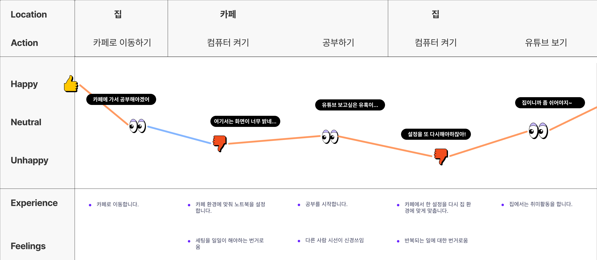
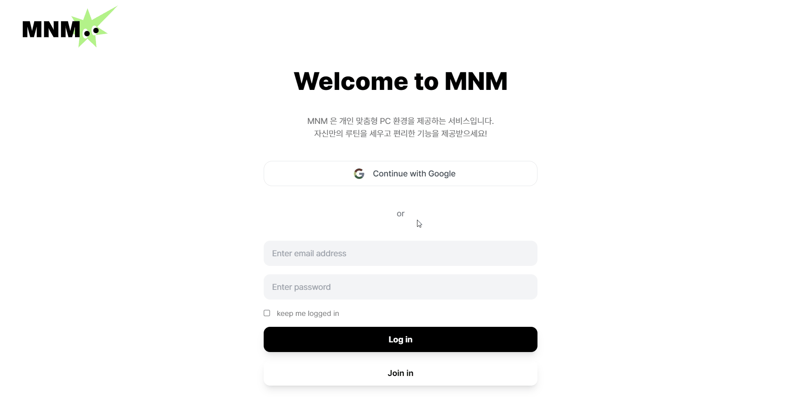
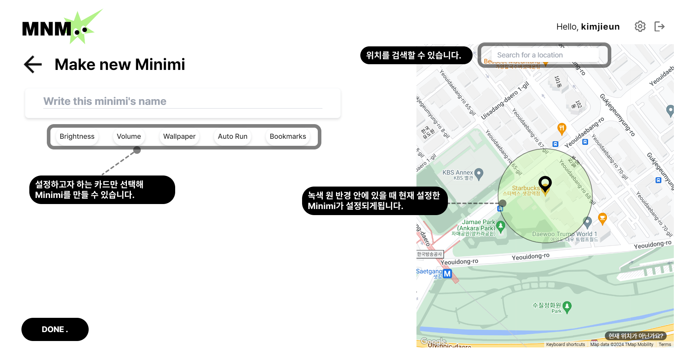
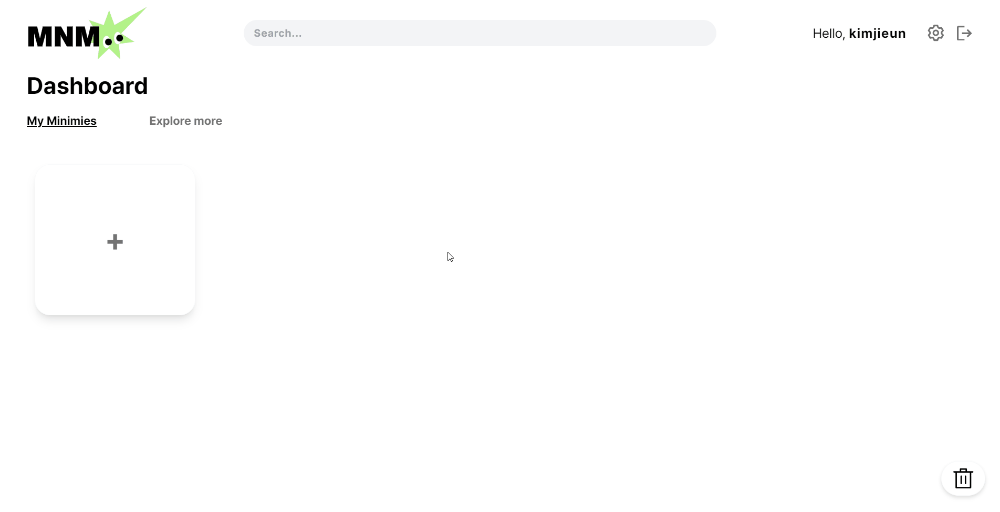
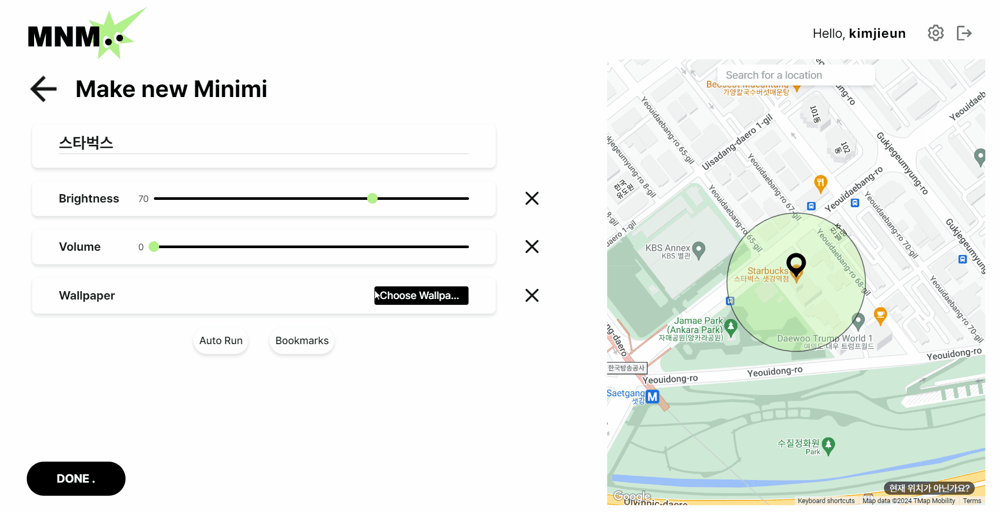
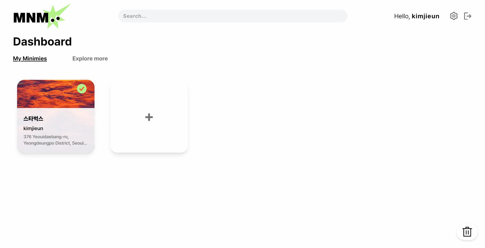
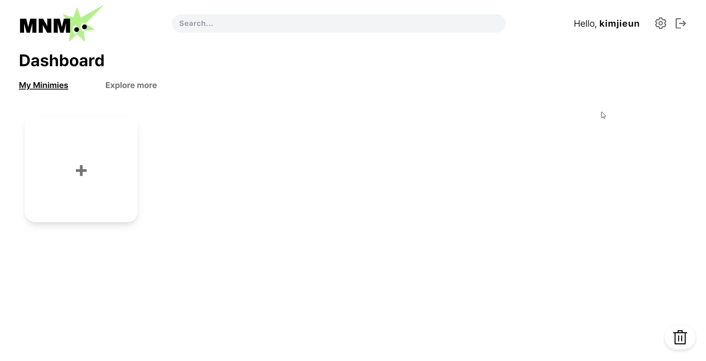
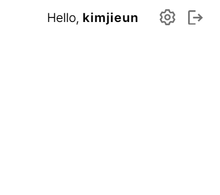

<div>
    <div>
    <h1>⭐ Minimi</h1>
    <br/>
    <br/>
    
    <br/>
    <br/>
    <br/>
    <div style="text-align: center">
    <p>Minimi는 사용자의 위치에 따라 실시간으로 노트북 설정을 자동으로 맞춰주는 <strong>자동화 서비스</strong>입니다.</p>
    <p>Minimi의 목표는 노트북 사용 경험을 혁신적으로 개선하는 것으로 몇 번의 클릭만으로 다양한 장소마다 개인 맞춤형 설정을 지정할 수 있으며, 유저들이 미리 설정해놓은 템플릿도 손쉽게 적용해 볼 수 있습니다. Minimi와 함께 더 스마트한 노트북 라이프를 즐겨보세요! 🚀✨</p>
    </div>
    <br />
    <br />
    <br />
    <h1>🖇️ Links</h1>
    <div>
    <div style="margin: 0 auto;">
    
    
    </div>
    <br />
    <br />
    <br />
    </div>
</div>

# 🗂️ Contents

**1. Motivation**

**2. Features**

- (1) 회원가입과 로그인
- (2) Minimi 생성하기
  - Brightness
  - Volume
  - Wallpaper
  - Auto Run
  - Bookmarks
- (3) 현재 위치 설정 타이머
- (4) 크로스 플랫폼 호환

**3. Tech Stack**

- (1) 왜 데스크톱 앱인가요?
- (2) 상태관리는 왜 Zustand를 선택했나요?

**4. Challenges**

<br/>
<br/>

# 💭 Research & Motivation

저는 평소 반복적인 작업을 효율적으로 처리하는 것을 선호하며, 일할 때 항상 효율성을 고려합니다.<br />
어떻게 하면 더 편리하게 작업할 수 있을지 고민하던 중, 평소 불편하게 느끼던 부분이 떠올랐습니다.

### Painpoint 찾기

스터디를 하면서 집뿐만 아니라 카페, 도서관 등 다양한 장소에서 작업을 하는 일이 많아졌습니다.<br />
장소마다 조명과 분위기가 달라 매번 노트북 세팅을 새로 맞추는 것이 번거로웠습니다.

**[사용자 여정 지도]**



이 문제를 해결하기 위해 조사를 해본 결과, 뉴스에서 20-30대의 63%가 집중력을 높이기 위해 여러 장소에서 작업을 하고 있다는 사실을 찾을 수 있었습니다. Painpoint의 구체화를 위해 사용자 여정지도를 구상했습니다.

사용자 여정지도를 통해 환경뿐만 아니라 위치에 따라 노트북의 사용 목적도 달라진다는 점을 발견했습니다. <br />
이러한 문제점을 인식하고 어떻게 하면 더 편리하게 이 문제를 해결할 수 있을지 고민하던 중 아이폰의 ‘단축키’ 기능이 떠올랐습니다.

### Insight 발견하기

아이폰의 ‘단축키’ 기능 중 ‘위치’ 기능은 특정 위치에 도착하거나 벗어날 때 자동으로 사용자가 설정한 단축 기능을 실행시킵니다. <br />
이 기능을 노트북에 적용하면 매우 편리하겠다는 생각이 들었습니다. 사용자의 위치에 따라 노트북의 설정이 자동으로 바뀌면, 집에서는 편안하게 취미생활을 즐길 수 있는 환경으로, 일하는 공간에서는 개인적인 정보는 보호하고 집중할 수 있는 환경으로 세팅이 변경되도록 할 수 있습니다. 이를 통해 매번 세팅을 변경해야 하는 번거로움을 줄이고, 사용자가 **더욱 편리한 삶을 살 수 있도록 하는 것**을 목표로 이 프로젝트를 시작하게 되었습니다.

<br />
<br />

# 📹 Features

### (1) 회원가입과 로그인

처음 방문하는 사용자라면 회원가입을 통해 자신의 아이디를 만들 수 있습니다.

<details>
  <summary>🖼️ 기능 구현</summary>

</details>

### (2) Minimi 생성하기

생성 카드 `+`를 클릭해 자동화할 목록을 구성할 수 있습니다.

**[createMinimi 화면 설명]**


> **자동화 기능 목록은 다음과 같습니다.**
>
> - 디스플레이 밝기
> - 디스플레이 음량
> - 배경화면 변경
> - 프로그램 자동실행
> - 브라우저 별 북마크 편집

<details>
  <summary>Minimi 만들기</summary>


</details>
<details>
  <summary>Minimi 삭제하기</summary>

</details>

### (3) 현재 위치 설정 타이머

현재 설정되어있는 위치를 확인하고, 임의로 몇 시간동안 해당 위치에 머무를지 설정할 수 있습니다.

<details>
  <summary>현재 위치 설정</summary>

</details>

### (4) 위치에 따른 Minimi 적용

사용자의 위치를 실시간으로 파악해 해당 위치에 설정되어있는 세팅으로 자동 실행 됩니다.

<details>
배경이 자동으로 변경되는 적용 예시
  <summary>Minimi 적용</summary>

</details>

</br>
</br>

# 🛠️ Tech Stacks

<div style="margin: 0 auto; width: 500px">


</div>
<br />

### 처음이지만 일렉트론을 도전해보겠어!

앞서 언급했듯이 Minimi를 개발하면서 가장 중요하게 생각한 것은 편의성이었습니다.<br/>
브라우저를 열고 웹사이트에 접속할 필요도 없이, 컴퓨터를 켜는 순간부터 Minimi에 쉽게 접근할 수 있다면 얼마나 좋을까요? <br />바탕화면에서 클릭 한 번으로 실행되고, 시스템 트레이에 항상 대기하며 작업을 방해하지 않고 설정이 세팅되도록 조용히 도와주는 서비스로 구현하고자 일렉트론을 선택했습니다.

> 1.  **빠른 접근성**: 브라우저를 열 필요 없이 즉시 실행 가능
> 2.  **시스템 리소스 활용**: 화면 밝기, 볼륨 등 시스템 설정에 직접 접근 가능
> 3.  **백그라운드 실행**: 사용자의 위치 변화를 지속적으로 감지하고 대응 가능
> 4.  **오프라인 지원**: 인터넷 연결 없이도 기본적인 기능 사용 가능

일렉트로의 호환성 또한 큰 장점으로 다가왔습니다. <br />일렉트론은 Windows, macOS, Linux 등 다양한 운영 체제에서 동일한 코드베이스로 애플리케이션을 배포할 수 있습니다. <br />이는 폭넓은 사용자 접근성을 확보할 수 있습니다.

Node.js를 사용해 개발함으로써 화면 밝기, 볼륨 등 시스템 설정에 직접 접근할 수 있습니다. <br />일렉트론은 이러한 로우 레벨 시스템 기능에 대한 API를 제공하여 Minimi의 핵심 기능 구현을 가능하게 했습니다.

마지막으로 HTML, CSS, JavaScript 등 웹 기술을 사용하여 데스크톱 애플리케이션을 개발할 수 있어 기존의 웹 개발 경험과 리소스를 효과적으로 활용할 수 있었습니다. 이는 개발 속도를 높이고 유지보수를 용이하게 하는 요인이 되었습니다.

### 상태관리는 가벼운 Zustand로

Zustand는 내부적으로 최적화되어 있어, 불필요한 리렌더링을 최소화합니다. Minimi와 같이 실시간으로 설정을 변경하는 앱에서 이는 매우 중요한 요소였습니다.

또한 다양한 미들웨어를 제공하며, 상태의 영속성을 쉽게 구현할 수 있습니다. 이는 Minimi의 설정을 저장하고 복원하는 데 유용하게 사용되었습니다.

Minimi는 앞으로 사용자의 요구에 맞춰 다양한 설정 옵션을 지속적으로 확장해 나갈 계획입니다. 이러한 확장성을 고려할 때, 데이터 규모가 증가하더라도 빠른 로딩 시간과 효율적인 리소스 사용을 유지하는 것이 중요합니다. Zustand는 이러한 요구사항을 충족시키는 동시에 비교적 가벼운 라이브러리로, 애플리케이션의 성능을 최적화하면서도 유연한 상태 관리를 가능하게 합니다. 이러한 이유로 Zustand는 Minimi의 현재와 미래의 요구사항을 모두 만족시키는 최적의 선택이었습니다.
<br/>
<br/>
<br/>

# 🚩 Challenges

## 0. 사용자 중심에서 생각하기

### 0-1. 어떤 선택지를 제공하면 좋을까?

Minimi의 핵심 기능을 구현하는 과정에서 가장 먼저 마주친 도전 과제는 '어떤 설정을 제공할 것인가?'였습니다. <br /> 이는 단순한 기술적 문제가 아닌, 사용자 경험(UX)의 핵심을 결정짓는 중요한 기획 단계였습니다.

첫 번째로 제 경험을 바탕으로, 위치에 따라 변화하는 환경 요소들을 분석했습니다. 특히 조명과 주변 소음 레벨의 변화가 작업 환경에 큰 영향을 미친다는 점에 주목했습니다.

두 번째로는 사용 목적을 세분화할 수 있었습니다.
노트북 사용의 주요 목적을 '공부'와 '취미'로 대별했습니다. 이는 단순히 '집중 모드 on/off'를 넘어, 각 목적에 최적화된 환경을 제공하기 위함이었습니다. 공부 목적일 때는 학습에 필요한 웹사이트 북마크를 최적화하고, 취미 목적일 때는 관련 리소스의 접근성을 향상시키는 방식으로 맞춤형 기능을 구상했습니다.

마지막으로, 특정 장소(예: 회사)에서 반복적으로 실행하는 앱(예: 메신저, 업무용 툴)을 자동으로 실행하는 기능을 구상했습니다. 이는 일상적인 태스크를 자동화하여 사용자의 생산성을 향상시키는 것을 목표로 했습니다.

이러한 체계적인 접근을 통해, Minimi의 현재 설정 목록이 탄생하게 되었습니다. 이 과정은 단순한 기능 나열이 아닌, 사용자의 실제 니즈와 행동 패턴에 기반한 기능 설계를 하는 것에 초점을 맞춰 선택했습니다.

## 1. 첫번째 관문: 회원가입과 로그인

"왜 로그인이 필요하죠?"🤔라고 생각하실 수 있지만, 사용자 간 설정 공유를 통해 더 나은 경험을 제공하고자 했습니다. <br /> 처음 방문하는 장소에서도 다른 사용자들의 최적화된 설정을 템플릿으로 가져와 즉시 적용할 수 있게 하기 위해 필요하다고 생각했습니다.

Firestore의 데이터 베이스를 사용할 계획이었기때문에 Firebase를 사용해 로그인 시스템을 구축했습니다.

### 1-1. CSP 오류

하지만 원클릭 구글 로그인을 구현한 후 아무리 클릭해도 로그인 팝업창이 뜨지 않는 상황이 발생했습니다.

오류를 분석해보니 구글 Identity Toolkit이 차단되고 있었습니다. 일렉트론 공식 문서를 탐독한 결과, Content Security Policy (CSP) 설정이 문제의 원인임을 발견했습니다.
CSP는 웹 애플리케이션의 보안을 강화하는 중요한 기능입니다. XSS, 데이터 주입 공격 등을 방지하기 위해 웹 페이지에 적용되는 보안 정책입니다.

### 1-2. 보안과 기능의 균형잡기

이 문제를 해결하기 위해 두 가지 접근 방식을 시도했습니다.

- 일렉트론 메인 프로세스 설정 조정:
  일렉트론의 mainWindow CSP를 수정하여 Google Identity Toolkit이 사용하는 URL을 허용했습니다.

```javascript
function createWindow() {
  const mainWindow = new BrowserWindow({
    // 기타 옵션들...
    webPreferences: {
      // 기타 설정들...
      webSecurity: true, // Web 보안 활성화
      contextIsolation: true,
      preload: join(__dirname, 'preload.js'),
      additionalArguments: ['--enable-features=NetworkService']
    }
  });

   mainWindow.webContents.on('did-start-loading', () => {
    mainWindow.webContents.session.webRequest.onHeadersReceived((details, callback) => {
      const newHeaders = {
        ...details.responseHeaders,
        'Content-Security-Policy': [
          "default-src 'self'",
          "script-src 'self' https://apis.google.com https://accounts.google.com https://identitytoolkit.googleapis.com",
          "style-src 'self' 'unsafe-inline'",
          "img-src 'self' https://identitytoolkit.googleapis.com"
        ].join(';')
      };
      callback({ responseHeaders: newHeaders });
    });
  });
```

- 리액트 HTML 최적화:
  index.html의 meta 태그에서 중복되는 CSP 설정 (default-src 'self')를 제거했습니다.

```javascript
<head>
  <meta charset="UTF-8">
  <meta name="viewport" content="width=device-width, initial-scale=1.0">
  <meta http-equiv="Content-Security-Policy" content="default-src 'self'; script-src 'self' https://apis.google.com;">
  <title>My Electron App</title>
</head>
```

**[팝업이 아닌 브라우저로 리디렉션**]


이러한 조치로 보안 오류 메시지는 사라졌지만, 여전히 로그인 팝업이 나타나지 않는 문제가 있었습니다.

프로젝트 기한이 다가오는 상황에서 다른 해결책은 팝업 대신 새로운 브라우저 창을 열어 구글 로그인을 우회하는 방식이었습니다. 또한 대체 로그인 방식을 추가했습니다. 이메일과 비밀번호를 이용한 로그인 옵션을 추가하여, 구글 계정이 없는 사용자들도 쉽게 가입할 수 있도록 접근성을 높였습니다.

## 2. 사용자 친화적 위치 서비스를 구현하려면?

### 2-1. 정확한 위치 파악이 필요해

사용자 경험 향상을 위해 정확한 위치 파악이 필수적이라고 판단했습니다. 이에 IP나 Wi-Fi 기반 측정보다 더 정확한 웹 브라우저의 Geolocation API를 채택했습니다.

Geolocation API는 GPS, Wi-Fi, IP 주소, Bluetooth 등 다양한 소스를 활용해 높은 정확도의 위치 정보를 제공합니다. 이는 Minimi가 더 정확한 설정 최적화를 할 수 있게 해주는 핵심 요소였습니다.

### 2-2. 실시간으로 위치 추적하기

초기에는 Google Maps API를 사용해 사용자의 현재 위치를 표시했습니다. 하지만 더 나은 UX를 위해 실시간 위치 업데이트가 필요하다고 판단했습니다.
여기서 중요한 UX 고려사항이 있었습니다

```javascript
let prevPosition = null

const checkPosition = () => {
  navigator.geolocation.getCurrentPosition((position) => {
    if (isPositionChanged(prevPosition, position)) {
      updateSettings(position)
      prevPosition = position
    }
  })
}

setInterval(checkPosition, 300000)
```

기존의 위치 기반 어플리케이션과 달리 Minimi는 노트북 사용 환경이라는 특수성이 포함됐습니다. 노트북은 스마트폰과 달리 이동 중 지속적인 화면 확인이 어렵습니다. 따라서 과도한 실시간 추적은 배터리 소모만 늘릴 뿐이라 판단했습니다.

이러한 특성을 고려하여 다양한 위치 추적 방식을 검토했습니다. 연속적인 실시간 업데이트는 정확도는 높지만 배터리 소모가 크고 노트북 환경에 부적합했습니다. 주기적 업데이트는 배터리 소모를 줄일 수 있지만 정확도가 다소 떨어질 수 있었습니다. 사용자 요청 시에만 업데이트하는 방식은 배터리 효율성은 높지만 실시간성이 떨어진다는 단점이 있었습니다.

최종적으로 주기적 업데이트와 사용자 요청 시 업데이트를 결합한 하이브리드 방식을 선택했습니다. 주기적 업데이트의 간격을 5분으로 설정했는데, 이는 여러 요인을 고려한 결과였습니다. 5분이라는 시간은 일반적인 도보 이동 속도를 고려했을 때 의미 있는 위치 변화를 감지할 수 있는 최소한의 시간이면서도, 배터리 소모를 크게 줄일 수 있는 간격이었습니다. 또한, 대부분의 사용자들이 한 장소에 머무는 평균 시간을 고려했을 때, 5분 간격의 업데이트가 실용적인 실시간성을 제공할 수 있다고 판단했습니다.

사용자가 원할 때 즉시 위치를 업데이트할 수 있으면서도, 백그라운드에서는 적절한 간격으로 위치를 갱신하여 불필요한 배터리 소모를 방지했습니다.

### 2-3. 시각적인 반경 정보 추가

개발을 하는 도중에도 계속해서 내가 어느 위치로 설정되어있는지 확인할 수 없어 불편함을 알게되었고,
정확한 좌표 매칭만으로는 사용자에게 불편한 경험을 줄 수 있다는 점을 인지할 수 있었습니다.😅 이에 특정 위치로부터 일정 반경 내에서도 설정이 적용되도록 개선했습니다.

```javascript
const getDistanceFromLatLonInMeters = (lat1, lon1, lat2, lon2) => {
  const R = 6371e3
  const dLat = (lat2 - lat1) * (Math.PI / 180)
  const dLon = (lon2 - lon1) * (Math.PI / 180)
  const a =
    Math.sin(dLat / 2) * Math.sin(dLat / 2) +
    Math.cos(lat1 * (Math.PI / 180)) *
      Math.cos(lat2 * (Math.PI / 180)) *
      Math.sin(dLon / 2) *
      Math.sin(dLon / 2)
  const c = 2 * Math.atan2(Math.sqrt(a), Math.sqrt(1 - a))
  const distance = R * c
  return distance
}
```

이 함수는 Haversine 공식을 사용해 두 지점 간의 거리를 계산하고, 설정된 반경 내에 있는지 확인합니다. 또한 Google Maps API를 활용해 이 반경을 시각적으로 표시함으로써, 사용자가 직관적으로 설정 적용 범위를 이해할 수 있게했습니다.

> Haversine 공식은 지구와 같은 구면 위에서 두 점 사이의 최단 거리를 계산하는 수학적 공식입니다. 이 공식은 지구의 곡률을 고려하여 위도와 경도 좌표를 사용해 정확한 거리를 구할 수 있어, GPS 기반 애플리케이션에서 널리 사용됩니다.

**[반경이 표시되지 않은 것 / 표시된 것]**


반경의 기준은 100미터로 설정했습니다. 이는 기존의 위치 서비스들을 고려해 설정했으며, 일상적인 작업 환경에서 적당한 위치 인식을 제공해 사용자 경험 측면에서 자연스러운 반응을 기대할 수 있는 크기임을 확인했습니다. 너무 크지도, 작지도 않은 이 반경은 사용자의 실제 활동 범위를 적절히 반영합니다.

### 2-4. 위치를 정확히 인식하지 못하는 문제

하지만 `Geolocation`으로 측정한 위치가 부정확하게 나타나는 문제가 지속적으로 발견되었습니다. 네트워크 기반 위치 추정의 한계를 알게 되었고, 이러한 문제는 사용자에게 불편함을 줄 수 있다고 판단했습니다.

- **사용자 정의 위치 추가**

사용자가 직접 자신의 현재 위치를 고정할 수 있는 기능을 추가하여 사용자 편의를 높이고자 했습니다. 사용자는 해당 위치에 머무는 동안 선택한 위치로 고정할 수 있는 타이머를 제공하여, 위치 추정 문제를 해결하고 편의성을 높일 수 있었습니다.



위치 설정 타이머는 이러한 기능을 보완하기 위해 추가한 장치입니다. 사용자가 원할 때 고정 위치를 취소하거나 다시 설정할 수 있도록 하여, 위치에 대해 정확하게 인지할 수 있게 했습니다. 이러한 기능을 통해 사용자는 더 정확한 위치 정보를 얻고, geolocation의 부정확성으로 인한 불편을 최소화할 수 있습니다.

## 3. 사용자의 노트북 설정을 어떻게 직접 조작할 수 있을까?

정확한 위치 파악이 가능해진 후, 다음 과제는 사용자의 노트북 설정을 직접 컨트롤하는 것이었습니다. 이를 위해 Node.js의 `child_process` 모듈을 활용하여 시스템 명령어를 실행하는 방식을 구현했습니다.

호환성 향상을 위해 사용자의 운영체제를 감지하고, 해당 OS에 맞는 명령어를 처리하도록 설계했습니다

```javascript
import os from 'os'
const platform = os.platform()

if (platform === 'win32') {
  // Windows 명령어 처리
} else if (platform === 'darwin') {
  // macOS 명령어 처리
}
```

비록 플랫폼 별로 명령어를 작성해야했지만 위와 같은 처리는 크로스 플랫폼 환경에서도 모두 잘 동작하도록 돕습니다.

Windows와 macOS를 주요 대상으로 판단하여 이 두 운영체제에 대한 처리를 중점적으로 구현했습니다.

시스템 명령어 구현 과정에서 밝기, 볼륨, 배경화면 등 다양한 도전 과제가 있었습니다. 그 중 특히 챌린지가 되었던 부분들을 소개하겠습니다.

### 3-1. 폴더 탐색하기

Auto Run 기능 구현 시, 초기에는 사용자의 모든 파일에서 응용 프로그램을 찾아내는 방식을 사용했습니다. 그러나 이 방법은 처리 시간이 길어 사용자 경험을 저해할 수 있었습니다.
이를 개선하기 위해, 사용자가 자주 사용하는 프로그램만을 선별하는 방식으로 전환했습니다. 바탕화면이나 시작 메뉴의 바로 가기(.lnk) 파일들을 탐색하여 실제 실행 파일(.exe)의 경로를 추출하는 방식을 채택했습니다. 이를 통해 사용자의 선호도를 반영하면서도 처리 속도를 개선할 수 있었습니다.

### 3-2. 편의성 높이기

### 3-3. API 모듈 사용

볼륨, 배경화면 등의 설정 변경을 위해 Node.js의 전용 모듈을 활용했습니다. 이를 통해 크로스 플랫폼 호환성을 유지하면서도 작업 효율성을 높일 수 있었습니다. 예를 들어, 볼륨 조절이나 배경화면 변경과 같은 작업을 더욱 빠르고 안정적으로 수행할 수 있게 되었습니다.

<br/>
<br/>
<br/>

# 👂 사용자 피드백과 앞으로의 계획

pre-release 버전을 배포한 후, 지속적인 개선을 위해 세 명의 사용자에게 직접 사용해 보도록 하고 피드백을 수집했습니다.
주요 개선 사항으로 지적된 부분은 다음과 같습니다:

- 버튼 클릭 후 처리 시간이 길어질 때 로딩 표시가 없는 점
- Minimi 생성 후 일시적인 멈춤 현상

이러한 피드백은 사용자 경험에 중요한 영향을 미치는 요소들입니다. 특히 로딩 표시의 부재는 UX 측면에서 매우 중요한 문제임을 인식할 수 있었습니다. 사용자에게 현재 진행 중인 작업의 상태를 시각적으로 알려주는 것은 앱의 반응성과 신뢰성 인식에 큰 영향을 미칩니다.
앞으로의 계획은 이러한 문제점들을 효율적으로 해결하는 것입니다.

**로딩 인디케이터 추가:** 긴 처리 시간이 필요한 작업에 대해 시각적 피드백을 제공하여 사용자의 불안감을 줄이고 앱의 반응성을 개선할 계획입니다.
**성능 최적화:** Minimi 생성 과정에서의 일시적 멈춤 현상을 해결하기 위해 백그라운드 처리 방식 개선 및 리소스 사용 최적화를 진행할 예정입니다.

이러한 개선을 통해 Minimi의 사용자 경험을 한층 더 향상시키고, 더욱 안정적이고 반응성 높은 애플리케이션으로 발전시켜 나갈 계획입니다.
