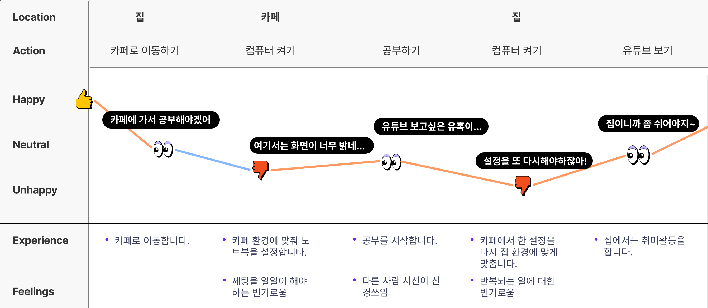
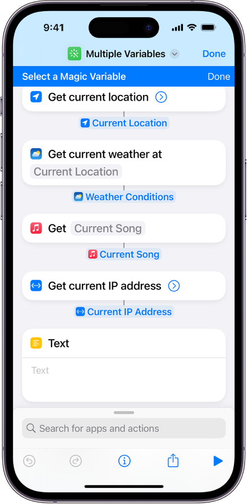
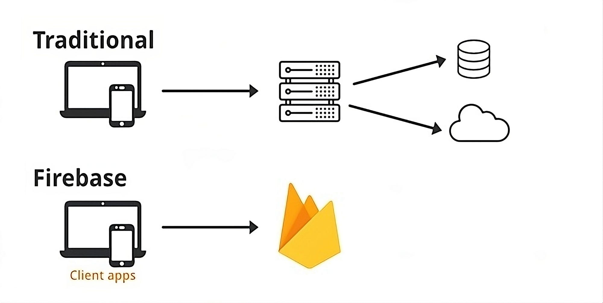
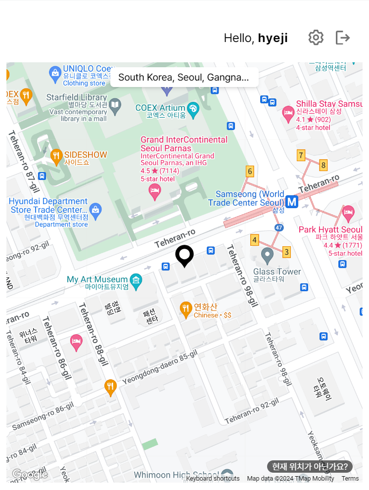
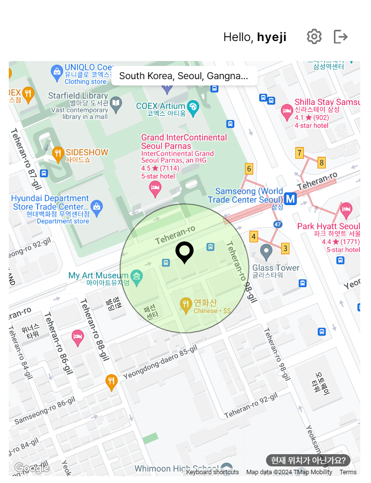
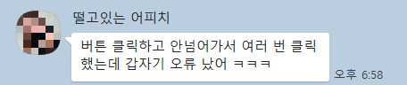

<div>
    <h1>⭐ Minimi</h1>
    <div align="center">
    <br/>
    <br/>
    
    <br/>
    <br/>
    <br/>
    <div style="text-align: center">
    <p>Minimi는 사용자의 위치에 따라 실시간으로 노트북 설정을 자동으로 맞춰주는 <strong>자동화 서비스</strong>입니다.</p>
    <p>Minimi의 목표는 노트북 사용 경험을 혁신적으로 개선하는 것으로 몇 번의 클릭만으로 다양한 장소마다 개인 맞춤형 설정을 지정할 수 있으며, 유저들이 미리 설정해놓은 템플릿도 손쉽게 적용해 볼 수 있습니다. <br/> 
      Minimi와 함께 더 스마트한 노트북 라이프를 즐겨보세요! 🚀✨</p>
    </div>
    <br />
    <br />
    <h3><strong>Links</strong></h3>
    <div style="margin: 0 auto;">
    <a href="https://github.com/Joohyeji/Minimi/releases/tag/v.1.0.0" target="_blank"></a>
    <a href="https://www.notion.so/Minimi-e2ba7b7553d04020a114b0cac9d115cf" target="_blank">
    </a>
    </div>
    <br />
    <br />
    <br />
    </div>
</div>

# 🗂️ Contents

**[💭 Research & Motivation](#research--motivation)**

- [Painpoint 발견하기](#painpoint-찾기)</br>
- [Insight 찾기](#painpoint-찾기)</br>

**[📹 Features](#features)** </br>
**[🛠️ Tech Stacks](#tech-stacks)** </br>

- [처음이지만 일렉트론을 선택한 이유](#처음이지만-일렉트론을-선택한-이유)
- [상태관리는 가벼운 zustand로](#상태관리는-가벼운-zustand로)</br>

**[🚩 Challenges](#challenges)** </br>

- **[0. 사용자 중심에서 생각하기](#0-사용자-중심에서-생각하기)** </br>
  - [0-1. 어떤 선택지를 제공하면 좋을까?](#0-1-어떤-선택지를-제공하면-좋을까)</br>
  - [0-2. 실시간 설정 공유 데이터를 어떻게 구축하지?](#0-2-실시간-설정-공유-데이터를-어떻게-구축하지)</br>
- **[1. 보안과 기능 간의 균형 잡기](#1-보안과-기능-간의-균형-잡기)** </br>
  - [1-1. CSP 오류 발생](#1-1-csp-오류-발생)
  - [1-2. 어떻게 일렉트론 보안 설정을 돌파할 수 있을까?](#1-2-어떻게-일렉트론-보안-설정을-돌파할-수-있을까)
- **[2. 사용자 친화적 위치 서비스를 구현하려면?](#2-사용자-친화적-위치-서비스를-구현하려면)**
  - [2-1. 정확한 위치 파악이 필요해](#2-1-정확한-위치-파악이-필요해)
  - [2-2. 실시간으로 위치 추적하기](#2-2-실시간으로-위치-추적하기)
  - [2-3. 시각적인 반경 정보 추가](#2-3-시각적인-반경-정보-추가)
  - [2-4. 위치를 정확히 인식하지 못하는 문제](#2-4-위치를-정확히-인식하지-못하는-문제)
- **[3. 사용자의 노트북 설정을 어떻게 직접 조작할 수 있을까?](#3-사용자의-노트북-설정을-어떻게-직접-조작할-수-있을까)**
  - [3-1. 폴더 탐색하기](#3-1-폴더-탐색하기)
  - [3-2. 브라우저의 북마크 리스트 가져오기](#3-2-브라우저의-북마크-리스트-가져오기)
  - [3-3. API 모듈 사용](#3-3-api-모듈-사용) </br>

**[👂 사용자 피드백](#사용자-피드백)**

<br/>
<br/>

# Research & Motivation

저는 평소 반복적인 작업을 효율적으로 처리하는 것을 선호하며, 일할 때 항상 효율성을 고려하는 편입니다.<br />
프로젝트 아이디어를 떠올리던 중, 평소 불편하게 느끼던 부분이 떠올랐습니다.

### Painpoint 찾기

스터디를 하면서 집뿐만 아니라 카페, 도서관 등 다양한 장소에서 작업을 하는 일이 많아졌습니다. 각 장소마다 조명과 분위기가 다르다 보니, 작업할 때마다 노트북 세팅을 새롭게 조정해야 하는 번거로움이 있었습니다. 조명 밝기, 화면 밝기, 소리 크기 등 설정을 장소에 따라 반복적으로 변경하는 과정에서 효율성이 떨어지는 것을 느꼈습니다.

**[사용자 여정 지도]**



이이 문제를 단순히 나만의 불편함으로 생각하기보다, 더 많은 사람들에게 해당될 수 있는지 확인하기 위해 조사를 시작했습니다. 관련 뉴스를 찾던 중, 20-30대의 63%가 집중력을 높이기 위해 여러 장소에서 작업을 한다는 통계를 발견했습니다. 이로 인해, 저만의 문제가 아니라 상당수의 사용자가 느끼는 공통된 불편함일 가능성을 확인할 수 있었습니다.

이를 바탕으로 사용자의 행동과 감정을 체계적으로 정리할 수 있는 도구가 필요하다고 판단하여, **사용자 여정 지도**를 구상했습니다. 이를 통해 사용자가 장소에 따라 노트북을 사용하는 목적과 환경이 달라진다는 점을 명확히 이해할 수 있었습니다. 예를 들어, 도서관에서는 주로 조용한 환경에서의 공부에 초점이 맞춰지고, 카페에서는 배경 소음 속에서의 작업이 더 적합할 수 있다는 점을 발견했습니다.

이러한 인사이트를 바탕으로, 어떻게 하면 더 간편하고 효율적으로 이 문제를 해결할 수 있을지 고민했습니다. 그 과정에서 아이폰의 ‘단축어’ 기능이 떠올랐습니다.

### Insight 발견하기

<div align="center">
  
  <p style="font-size: 14px">출처: apple 공식 홈페이지</p>
</div>

아이폰의 ‘단축어’ 기능 중 ‘위치’ 기능은 특정 위치에 도착하거나 벗어날 때 자동으로 사용자가 설정한 단축 기능을 실행시킵니다. <br />
특정 상황에 맞게 여러 설정을 자동으로 적용할 수 있는 것처럼, 노트북도 사용자가 위치에 따라 필요한 설정을 자동으로 적용할 수 있다면 훨씬 편리해질 것이라고 생각했습니다. 사용자의 위치에 따라 노트북의 설정이 자동으로 바뀌면, 집에서는 편안하게 취미생활을 즐길 수 있는 환경으로, 일하는 공간에서는 개인적인 정보는 보호하고 집중할 수 있는 환경으로 세팅이 변경되도록 할 수 있습니다. 이를 통해 매번 세팅을 변경해야 하는 번거로움을 줄이고, 사용자가 **더욱 편리한 삶을 살 수 있도록 하는 것**을 목표로 이 프로젝트를 시작하게 되었습니다.

<br />
<br />

# Features

### (1) 회원가입과 로그인

처음 방문하는 사용자라면 회원가입을 통해 자신의 아이디를 만들 수 있습니다.

<details>
  <summary>기능 구현</summary>

</details>

### (2) Minimi 생성하기

생성 카드 `+`를 클릭해 자동화할 목록을 구성할 수 있습니다.

**[createMinimi 화면 설명]**


> **자동화 기능 목록은 다음과 같습니다.**
>
> - 디스플레이 밝기
> - 디스플레이 음량
> - 배경화면 변경
> - 프로그램 자동실행
> - 브라우저 별 북마크 편집

<details>
  <summary>Minimi 만들기</summary>


</details>
<details>
  <summary>Minimi 삭제하기</summary>

</details>

### (3) 현재 위치 설정 타이머

현재 설정되어있는 위치를 확인하고, 임의로 몇 시간동안 해당 위치에 머무를지 설정할 수 있습니다.

<details>
  <summary>현재 위치 설정</summary>

</details>

### (4) 위치에 따른 Minimi 적용

사용자의 위치를 실시간으로 파악해 해당 위치에 설정되어있는 세팅으로 자동 실행 됩니다.

<details>
배경이 자동으로 변경되는 적용 예시
  <summary>Minimi 적용</summary>

</details>

</br>
</br>

# Tech Stacks

<div align=center width=300px>


</div>

<br />

### 처음이지만 일렉트론을 선택한 이유

앞서 언급했듯이 Minimi를 개발하면서 가장 중요하게 생각한 것은 **편의성**이었습니다.<br/>
브라우저를 열고 웹사이트에 접속할 필요도 없이, 컴퓨터를 켜는 순간부터 Minimi에 쉽게 접근할 수 있다면 얼마나 좋을까요? <br />바탕화면에서 클릭 한 번으로 실행되고, 시스템 트레이에서 항상 대기하며 작업을 방해하지 않고, 사용자의 설정을 조용히 도와주는 서비스가 이상적이라고 생각했습니다. 이러한 이유로 **일렉트론(Electron)**을 선택하게 되었습니다.

> 1.  **빠른 접근성**: 브라우저를 열지 않고도 즉시 애플리케이션을 실행할 수 있다는 점이 큰 장점이었습니다. 사용자는 단지 바탕화면의 아이콘을 클릭하기만 하면 Minimi에 접근할 수 있습니다.
> 2.  **시스템 리소스 활용**: 일렉트론을 사용하면 화면 밝기, 볼륨 등 시스템 설정에 직접 접근할 수 있습니다. 이러한 기능은 Minimi의 핵심 기능인 위치 기반 설정 자동화에 필수적이었습니다.
> 3.  **백그라운드 실행**: 사용자의 위치 변화를 지속적으로 감지하고, 이에 따라 자동으로 설정을 조정할 수 있도록 백그라운드에서 조용히 실행될 수 있는 환경을 제공했습니다.

일렉트론의 호환성도 중요한 요소였습니다. 일렉트론은 Windows, macOS, Linux 등 다양한 운영 체제에서 동일한 코드베이스로 애플리케이션을 배포할 수 있습니다. 이를 통해 Minimi는 폭넓은 사용자에게 접근할 수 있는 기회를 제공받았습니다.

또한, Node.js를 사용하여 시스템 설정에 직접 접근할 수 있는 기능을 구현할 수 있었습니다. 일렉트론은 이러한 로우 레벨 시스템 기능에 대한 API를 제공하여, Minimi의 핵심 기능을 효과적으로 구현할 수 있게 했습니다.

마지막으로, HTML, CSS, JavaScript 등 익숙한 웹 기술을 사용하여 데스크톱 애플리케이션을 개발할 수 있다는 점도 일렉트론의 큰 장점이었습니다. 이는 기존의 웹 개발 경험을 효과적으로 활용할 수 있게 해주었고, 개발 속도를 높이며 유지보수를 용이하게 했습니다.

### 상태관리는 가벼운 Zustand로

Minimi와 같은 실시간 설정 변경이 중요한 애플리케이션에서, 상태 관리는 성능과 직결되는 중요한 요소였습니다. 이러한 이유로 Zustand를 선택했습니다. Zustand는 내부적으로 최적화되어 있어 불필요한 리렌더링을 최소화할 수 있습니다. 이로 인해, 사용자가 다양한 환경에서 설정을 변경할 때, Minimi가 빠르고 일관된 성능을 제공할 수 있습니다.

또한 Zustand는 다양한 미들웨어를 제공하여 상태의 영속성을 쉽게 구현할 수 있습니다. 이 기능은 Minimi의 설정을 저장하고 복원하는 데 매우 유용하게 활용되었습니다. 예를 들어, 사용자가 특정 장소에서 선호하는 화면 밝기나 볼륨 설정을 저장해 두면, 다음에 해당 장소에 도착했을 때 자동으로 적용됩니다. 이로써 사용자 경험이 크게 향상될 수 있습니다.

Minimi는 앞으로 사용자의 요구에 맞춰 다양한 설정 옵션을 지속적으로 확장해 나갈 계획입니다. 이러한 확장성을 고려할 때, 데이터의 양이 증가하더라도 빠른 로딩 시간과 효율적인 리소스 사용을 유지하는 것이 중요합니다. Zustand는 가벼운 라이브러리임에도 불구하고, 이러한 요구를 충족시키는 성능을 제공합니다.

마지막으로, Zustand는 매우 유연하여 Minimi의 상태 관리 구조를 필요에 따라 쉽게 확장할 수 있습니다. 이로 인해 앞으로 새로운 기능이 추가되더라도 기존의 성능을 유지하면서도 유연하게 대응할 수 있는 Zustand를 선택하게 되었습니다.
<br/>
<br/>
<br/>

# Challenges

## 0. 사용자 중심에서 생각하기

### 0-1. 어떤 선택지를 제공하면 좋을까?

Minimi의 핵심 기능을 구현하는 과정에서 가장 먼저 마주친 도전 과제는 '어떤 설정을 제공할 것인가?'였습니다. <br /> 이는 단순한 기술적 문제가 아닌, 사용자 경험(UX)의 핵심을 결정짓는 중요한 기획 단계였습니다.

첫 번째로 제 경험을 바탕으로, 위치에 따라 변화하는 환경 요소들을 분석했습니다. 특히 조명과 주변 소음 레벨의 변화가 작업 환경에 큰 영향을 미친다는 점에 주목했습니다.

두 번째로는 사용 목적을 세분화할 수 있었습니다.
노트북 사용의 주요 목적을 '공부'와 '취미'로 대별했습니다. 이는 단순히 '집중 모드 on/off'를 넘어, 각 목적에 최적화된 환경을 제공하기 위함이었습니다. 공부 목적일 때는 학습에 필요한 웹사이트 북마크를 최적화하고, 취미 목적일 때는 관련 리소스의 접근성을 향상시키는 방식으로 맞춤형 기능을 구상했습니다.

마지막으로, 특정 장소(예: 회사)에서 반복적으로 실행하는 앱(예: 메신저, 업무용 툴)을 자동으로 실행하는 기능을 구상했습니다. 이는 일상적인 태스크를 자동화하여 사용자의 생산성을 향상시키는 것을 목표로 했습니다.

이러한 체계적인 접근을 통해, Minimi의 현재 설정 목록이 탄생하게 되었습니다. 이 과정은 단순한 기능 나열이 아닌, 사용자의 실제 니즈와 행동 패턴에 기반한 기능 설계를 하는 것에 초점을 맞춰 선택했습니다.

### 0-2. 실시간 설정 공유 데이터를 어떻게 구축하지?

<div align="center">
  
</div>

Minimi를 구현하면서 사용자가 처음 방문하는 장소에서도 마치 자주 다녀온 곳처럼 편안하게 설정할 수 있도록 하고싶었습니다. 이를 위해 다른 사용자들이 해당 장소에 설정한 Minimi를 즉시 적용하고 한 눈에 볼 수 있는 Explorer 페이지를 구상했습니다.

이러한 사용자 간 설정 공유 기능은 실시간성이 매우 중요하다고 생각했습니다. 한 사용자가 설정을 변경하면 그 정보를 즉시 다른 모든 사용자에게 제공해야 했거든요.
일반적으로 이런 실시간 데이터 동기화는 Socket 서버와 클라이언트를 연결하여 구현하지만 이 방식은 다음과 같은 추가적인 고려사항을 수반했습니다.

1. Socket 서버 구축에 따른 관리 포인트 증가
2. 클라이언트 연결 증가에 따른 서버 확장 필요성
3. 인프라 관리의 복잡성 증가

이러한 잠재적 문제들을 고려하여, Socket 서버 구축 대신 Google Cloud Firestore를 활용하기로 결정했습니다. Firestore는 실시간 데이터 동기화 기능을 제공하면서도, 위의 문제들을 효과적으로 해결할 수 있는 솔루션이었습니다.

<br />
<br />

## 1. 보안과 기능 간의 균형 잡기

"왜 로그인이 필요하죠?"🤔라고 생각하실 수 있지만, 앞서 말씀드린 것과 같이 Minimi는 사용자 간 설정 공유를 통해 더 나은 경험을 제공하고자 했습니다. 사용자가 처음 방문하는 장소에서도 다른 사용자들이 최적화한 설정을 템플릿으로 가져와 즉시 적용할 수 있도록 하기 위해, 로그인 시스템이 필요하다고 판단했습니다. 이를 위해 Firestore 데이터베이스와 Firebase를 사용해 로그인 시스템을 구축했습니다.

<br />

### 1-1. CSP 오류 발생

원클릭 구글 로그인을 구현한 후, 클릭해도 로그인 팝업창이 뜨지 않는 문제가 발생했습니다. 오류를 분석한 결과, Google Identity Toolkit이 차단되고 있음을 확인했습니다. 일렉트론 공식 문서를 검토한 끝에, 이 문제의 원인이 Content Security Policy(CSP) 설정에 있다는 것을 발견했습니다.

> **콘텐츠 보안 정책 CSP**
>
> CSP는 웹 애플리케이션의 보안을 강화하는 중요한 기능으로 주로 XSS 공격을 완화하고 감지하는 데 사용됩니다.
> CSP를 통해 서버 관리자는 브라우저가 실행할 수 있는 스크립트의 출처를 제한할 수 있습니다. 브라우저가 실행 가능한 스크립트의 합법적인 소스로 간주해야 하는 인터넷 도메인을 지정하며, CSP 호환 브라우저는 허용된 도메인에서 검색된 소스 파일이 포함된 스크립트만 실행하고 다른 모든 스크립트(인라인 스크립트 및 HTML 이벤트 처리 속성 포함)는 무시합니다.

<br />

### 1-2. 어떻게 일렉트론 보안 설정을 돌파할 수 있을까?

이 문제를 해결하기 위해 두 가지 접근 방식을 시도했습니다.

- 일렉트론 메인 프로세스 설정 조정:
  일렉트론의 mainWindow에서 CSP를 수정하여 Google Identity Toolkit이 사용하는 URL을 허용했습니다. 이를 통해 Google 로그인 팝업이 차단되지 않도록 설정을 변경했습니다.

```javascript
function createWindow() {
  const mainWindow = new BrowserWindow({
    // 기타 옵션들...
    webPreferences: {
      // 기타 설정들...
      webSecurity: true, // Web 보안 활성화
      contextIsolation: true,
      preload: join(__dirname, 'preload.js'),
      additionalArguments: ['--enable-features=NetworkService']
    }
  });

   mainWindow.webContents.on('did-start-loading', () => {
    mainWindow.webContents.session.webRequest.onHeadersReceived((details, callback) => {
      const newHeaders = {
        ...details.responseHeaders,
        'Content-Security-Policy': [
          "default-src 'self'",
          "script-src 'self' https://apis.google.com https://accounts.google.com https://identitytoolkit.googleapis.com",
          "style-src 'self' 'unsafe-inline'",
          "img-src 'self' https://identitytoolkit.googleapis.com"
        ].join(';')
      };
      callback({ responseHeaders: newHeaders });
    });
  });
```

- 리액트 HTML 최적화:
  index.html의 meta 태그에서 중복되는 CSP 설정 (default-src 'self')를 제거했습니다.

```javascript
<head>
  <meta charset="UTF-8">
  <meta name="viewport" content="width=device-width, initial-scale=1.0">
  <meta http-equiv="Content-Security-Policy" content="default-src 'self'; script-src 'self' https://apis.google.com;">
  <title>My Electron App</title>
</head>
```

**[팝업이 아닌 브라우저로 리디렉션**]


이러한 조치로 보안 오류 메시지는 사라졌지만, 여전히 로그인 팝업이 나타나지 않는 문제가 있었습니다.

프로젝트 기한이 다가오는 상황에서 다른 해결책은 팝업 대신 새로운 브라우저 창을 열어 구글 로그인을 우회하는 방식이었습니다. 또한 대체 로그인 방식을 추가했습니다. 이메일과 비밀번호를 이용한 로그인 옵션을 추가하여, 구글 계정이 없는 사용자들도 쉽게 가입할 수 있도록 접근성을 높였습니다.

<br />
<br />

## 2. 사용자 친화적 위치 서비스를 구현하려면?

### 2-1. 정확한 위치 파악이 필요해

| **위치 파악 방법** | **Geolocation API**                       | **IP 주소 기반 위치 파악**                    | **Wi-Fi 기반 위치 파악**                      | **GPS 기반 위치 파악**                     | **Bluetooth 기반 위치 파악**                 |
| ------------------ | ----------------------------------------- | --------------------------------------------- | --------------------------------------------- | ------------------------------------------ | -------------------------------------------- |
| **사용 기술**      | GPS, Wi-Fi, IP 주소, Bluetooth 등         | IP 주소                                       | 주변 Wi-Fi 네트워크                           | GPS 위성                                   | Bluetooth 신호                               |
| **장점**           | 다양한 소스를 활용해 높은 정확도 제공     | 사용자 권한 불필요, 간단한 구현 가능          | 실내에서도 작동 가능, 도시 수준의 정확도 제공 | 매우 높은 정확도, 이동 중 위치 추적에 적합 | 근거리 위치 파악에 매우 정확                 |
| **단점**           | 사용자 권한 필요, 일부 환경에서 오차 가능 | 정확도가 낮고, 도시 수준의 위치 파악에 한정됨 | Wi-Fi 네트워크 밀도에 따라 정확도 변동        | 실내 및 밀집된 도시 환경에서는 신호 약함   | 짧은 범위로 인해 제한적, Bluetooth 장치 필요 |
| **정확도**         | **높음**                                  | **낮음**                                      | **중간**                                      | **매우 높음**                              | **매우 높음** (근거리)                       |

사용자 경험 향상을 위해 정확한 위치 파악이 필수적이라고 판단했습니다. 이에 IP나 Wi-Fi 기반 측정보다 더 정확한 웹 브라우저의 Geolocation API를 채택했습니다.

Geolocation API는 GPS, Wi-Fi, IP 주소, Bluetooth 등 다양한 소스를 활용해 높은 정확도의 위치 정보를 제공합니다. 이는 Minimi가 더 정확한 설정 최적화를 할 수 있게 해주는 핵심 요소였습니다.

<br />

### 2-2. 실시간으로 위치 추적하기

초기에는 Google Maps API를 사용해 사용자의 현재 위치를 표시했습니다. 하지만 더 나은 UX를 위해 실시간 위치 업데이트가 필요하다고 판단했습니다.
여기서 중요한 UX 고려사항이 있었습니다

```javascript
let prevPosition = null

const checkPosition = () => {
  navigator.geolocation.getCurrentPosition((position) => {
    if (isPositionChanged(prevPosition, position)) {
      updateSettings(position)
      prevPosition = position
    }
  })
}

setInterval(checkPosition, 300000)
```

기존의 위치 기반 어플리케이션과 달리 Minimi는 노트북 사용 환경이라는 특수성이 포함됐습니다. 노트북은 스마트폰과 달리 이동 중 지속적인 화면 확인이 어렵습니다. 따라서 과도한 실시간 추적은 배터리 소모만 늘릴 뿐이라 판단했습니다.

이러한 특성을 고려하여 다양한 위치 추적 방식을 검토했습니다. 연속적인 실시간 업데이트는 정확도는 높지만 배터리 소모가 크고 노트북 환경에 부적합했습니다. 주기적 업데이트는 배터리 소모를 줄일 수 있지만 정확도가 다소 떨어질 수 있었습니다. 사용자 요청 시에만 업데이트하는 방식은 배터리 효율성은 높지만 실시간성이 떨어진다는 단점이 있었습니다.

최종적으로 주기적 업데이트와 사용자 요청 시 업데이트를 결합한 하이브리드 방식을 선택했습니다. 주기적 업데이트의 간격을 5분으로 설정했는데, 이는 여러 요인을 고려한 결과였습니다. 5분이라는 시간은 일반적인 도보 이동 속도를 고려했을 때 의미 있는 위치 변화를 감지할 수 있는 최소한의 시간이면서도, 배터리 소모를 크게 줄일 수 있는 간격이었습니다. 또한, 대부분의 사용자들이 한 장소에 머무는 평균 시간을 고려했을 때, 5분 간격의 업데이트가 실용적인 실시간성을 제공할 수 있다고 판단했습니다.

사용자가 원할 때 즉시 위치를 업데이트할 수 있으면서도, 백그라운드에서는 적절한 간격으로 위치를 갱신하여 불필요한 배터리 소모를 방지했습니다.

<br />

### 2-3. 시각적인 반경 정보 추가

|              반경이 표시되지 않은 것              |                 반경이 표시된 것                  |
| :-----------------------------------------------: | :-----------------------------------------------: |
|  |  |

개발 과정에서 현재 설정된 위치를 시각적으로 확인하기 어렵다는 점을 깨달았습니다. 또한, 정확한 좌표 매칭만으로는 사용자에게 불편한 경험을 줄 수 있다는 것을 인지하게 되었습니다. 좀 더 유연한 좌표를 구하지 않으면 사용자는 한 치의 오차도 없이 정확히 그 자리에 가야만 설정이 적용될 것입니다. 이에 따라 특정 위치로부터 일정 반경 내에서도 설정이 적용되도록 개선했습니다.

정확한 반경을 계산하고 표시하기 위해서는 지구의 곡률을 고려해야 합니다. 단순히 x, y 좌표의 최단거리를 재는 방식으로는 위도(Latitude)와 경도(Longitude)를 사용할 때 큰 오차가 발생할 수 있습니다. 특히 거리가 길어질수록 지구 곡률의 영향이 커지게 됩니다.
이러한 문제를 해결하기 위해 하버사인(Haversine) 공식을 사용했습니다. 이 공식은 지구와 같은 구면 위에서 두 점 사이의 최단 거리를 계산하는 수학적 방법으로, GPS 기반 애플리케이션에서 널리 사용됩니다.

```javascript
const getDistanceFromLatLonInMeters = (lat1, lon1, lat2, lon2) => {
  const R = 6371e3
  const dLat = (lat2 - lat1) * (Math.PI / 180)
  const dLon = (lon2 - lon1) * (Math.PI / 180)
  const a =
    Math.sin(dLat / 2) * Math.sin(dLat / 2) +
    Math.cos(lat1 * (Math.PI / 180)) *
      Math.cos(lat2 * (Math.PI / 180)) *
      Math.sin(dLon / 2) *
      Math.sin(dLon / 2)
  const c = 2 * Math.atan2(Math.sqrt(a), Math.sqrt(1 - a))
  const distance = R * c
  return distance
}
```

이 함수는 두 지점 간의 거리를 계산하고, 설정된 반경 내에 있는지 확인합니다. 또한 Google Maps API를 활용해 이 반경을 시각적으로 표시함으로써, 사용자가 직관적으로 설정 적용 범위를 이해할 수 있게했습니다.

반경의 기준은 100미터로 설정했습니다. 이는 기존의 위치 서비스들을 고려해 설정했으며, 일상적인 작업 환경에서 적당한 위치 인식을 제공해 사용자 경험 측면에서 자연스러운 반응을 기대할 수 있는 크기임을 확인했습니다. 너무 크지도, 작지도 않은 이 반경은 사용자의 실제 활동 범위를 적절히 반영합니다.

<br />

### 2-4. 위치를 정확히 인식하지 못하는 문제

하지만 `Geolocation API`를 사용하여 위치를 측정했음에도 불구하고, 위치가 부정확하게 나타나는 문제가 지속적으로 발견되었습니다. `Haversine` 공식을 이용해 반경을 정확히 계산하더라도, 사용자의 실제 위치를 잘못 인식한다면 애플리케이션의 핵심 기능에 심각한 문제가 될 수 있었습니다. 원인 분석을 하기 위해 실시간 위치 업데이트하는 시간을 짧게 줄이고 찍히는 위치를 확인한 결과, 네트워크 기반 위치 추정의 한계를 파악했습니다. Wi-Fi나 셀룰러 네트워크를 통한 위치 추정은 때때로 부정확할 수 있다는 것입니다. 이러한 문제는 사용자에게 불편함을 줄 수 있다고 판단했습니다.

- **사용자 정의 위치 추가**

위치 인식의 정확도 문제를 해결하고 사용자 경험을 개선하기 위해, 사용자가 직접 자신의 현재 위치를 고정할 수 있는 기능을 추가하여 사용자 편의를 높이고자 했습니다. 사용자는 지도상에서 정확한 위치를 선택하거나 주소를 입력하여 현재 위치를 수동으로 설정할 수 있으며, 선택한 위치를 일정 시간 동안 고정할 수 있는 타이머 기능을 활용할 수 있습니다.

<div align="center">

</div>

위치 설정 타이머는 이러한 기능을 보완하기 위해 추가한 장치입니다.
타이머는 10분, 30분, 1시간, 2시간 등 다양한 옵션을 제공하여 사용자의 상황에 맞게 선택할 수 있게 했습니다. 이 기능은 사용자가 특정 장소에 머무는 동안 위치 변동으로 인한 오류를 방지합니다. 또한, 타이머 작동 중에도 사용자는 언제든지 위치 고정을 해제하거나 새로운 위치로 업데이트할 수 있어, 이동 패턴 변화에 즉시 대응할 수 있습니다.
위치 고정 상태와 남은 시간을 직관적으로 표시하는 UI를 구현하고, 타이머 종료 전 알림을 제공하여 사용자가 필요시 시간을 연장하거나 위치를 업데이트할 수 있게 했습니다.

이러한 기능을 통해 사용자는 더 정확한 위치 정보를 얻고, `Geolocation`의 부정확성으로 인한 불편을 최소화할 수 있었습니다.

<br />
<br />

## 3. 사용자의 노트북 설정을 어떻게 직접 조작할 수 있을까?

정확한 위치 파악이 가능해진 후, 다음 과제는 사용자의 노트북 설정을 직접 컨트롤하는 것이었습니다. 이를 위해 `Node.js`의 `child_process` 모듈을 활용하여 시스템 명령어를 실행하는 방식을 구현했습니다.

호환성 향상을 위해 사용자의 운영체제를 감지하고, 해당 OS에 맞는 명령어를 처리하도록 설계했습니다

```javascript
import os from 'os'
const platform = os.platform()

if (platform === 'win32') {
  // Windows 명령어 처리
} else if (platform === 'darwin') {
  // macOS 명령어 처리
}
```

비록 플랫폼 별로 명령어를 작성해야했지만 위와 같은 처리는 크로스 플랫폼 환경에서도 모두 잘 동작하도록 돕습니다.

`Windows`와 `macOS`를 주요 대상으로 판단하여 이 두 운영체제에 대한 처리를 중점적으로 구현했습니다.

시스템 명령어 구현 과정에서 밝기, 볼륨, 배경화면 등 다양한 도전 과제가 있었지만 그 중 특히 챌린지가 되었던 부분들을 소개하겠습니다.

<br />

### 3-1. 폴더 탐색하기

Auto Run 기능 구현 시, 초기에는 사용자의 모든 파일에서 응용 프로그램을 찾아내는 방식을 사용했습니다. 그러나 이 방법은 처리 시간이 길어 사용자 경험을 저해할 수 있었습니다.
이를 개선하기 위해, 사용자가 자주 사용하는 프로그램만을 선별하는 방식으로 전환했습니다. 바탕화면이나 시작 메뉴의 바로 가기`(.lnk)` 파일들을 탐색하여 실제 실행 파일`(.exe)`의 경로를 추출하는 방식을 채택했습니다. 이를 통해 로딩 속도를 눈에띄게 개선했고 사용자의 선호도를 반영하면서도 처리 속도를 개선할 수 있었습니다.

<div align="center">
  
</div>

다만 사용자에게 선택권을 더 주기위해서 `Add Files` 버튼을 추가했습니다. 이로써 해당 버튼을 클릭하면 사용자가 원하는 파일 링크를 직접 추가할 수 있게 되었습니다. 기존의 파일들을 유지하면서도 사용자 맞춤형 기능을 제공함으로써 사용자 경험을 한층 더 개선할 수 있었습니다.

<br />

### 3-2. 브라우저의 북마크 리스트 가져오기

<div align="center">
  
</div>

응용 프로그램을 가져오는 작업과 유사하면서도, 북마크 리스트를 가져오는 작업은 몇 가지 추가적인 도전 과제를 제시했습니다. 가장 큰 어려움은 사용자가 어떤 브라우저를 사용할지 예측하기 어려워 다양한 브라우저에 대응해야 한다는 점과, 각 브라우저의 북마크 구조가 서로 다를 수 있다는 점이었습니다. 북마크 파일 내에 폴더를 담고 있는 구조 등 다양한 형식이 존재하기 때문에, 모든 가능한 구조를 고려하여 적절히 처리하는 것이 필요했습니다.
이러한 문제를 해결하기 위해, 우선 사용자들이 가장 많이 사용하는 브라우저를 조사했습니다. `Chrome`, `Edge`, `Safari`가 가장 많이 사용되는 브라우저임을 확인했고, 사용자의 운영체제에 따라 `Windows`일 경우 `Chrome`과 `Edge`를, `macOS`일 경우 `Safari`와 `Firefox`를 추가로 지원하여 편의성을 높이는 방식을 채택했습니다.

각 브라우저별로 북마크 파일의 형식과 저장 위치가 달랐기 때문에, 브라우저마다 다른 접근 방식을 사용했습니다. `Chrome`과 `Edge`의 경우 `JSON` 형식으로 저장된 북마크 파일을 `fs.readFileSync`를 사용하여 읽고 파싱했습니다. `Firefox`는 `SQLite` 데이터베이스를 사용하여 북마크 데이터를 쿼리했으며, `Safari`는 `XML` 형식의 `.plist` 파일을 `plist` 모듈을 사용하여 파싱했습니다. 이렇게 각 브라우저와 운영체제별로 북마크 파일의 경로와 형식을 다르게 처리하여 다양한 환경에서 북마크를 올바르게 읽어올 수 있었습니다.

마지막으로, 브라우저 간 북마크 호환성 문제를 해결하고자 했습니다. 각 브라우저마다 북마크 저장 방식이 달라 호환성 유지가 어려웠지만, 북마크 포맷의 규칙성을 발견하고 `Chrome`을 기준으로 포맷을 표준화했습니다. 다른 브라우저의 북마크를 `Chrome` 형식으로 변환하여 저장함으로써 호환성을 확보했습니다. 또한, 기존 북마크를 보호하기 위해 새로 업데이트된 북마크가 기존 북마크를 덮어쓰지 않도록 했습니다.
이러한 접근을 통해 사용자는 자신이 선호하는 브라우저의 북마크를 쉽게 Minimi로 가져와 활용할 수 있게 되었으며, 사용자에게 일관된 경험을 제공할 수 있었습니다.

<br />

### 3-3. API 모듈 사용

볼륨, 배경화면 등의 설정 변경을 위해 다양한 대안들을 검토했습니다. 그 중에서 `Node.js`의 전용 모듈을 활용하기로 결정했습니다. 이는 크로스 플랫폼 호환성과 작업 효율성 면에서 가장 큰 장점을 가지고 있었기 때문입니다.
또한 풍부한 오픈소스 모듈들이 존재하므로, 볼륨 조절이나 배경화면 변경 등의 기능을 보다 빠르고 안정적으로 구현할 수 있었습니다. 오픈소스 커뮤니티의 활발한 활동과 지속적인 업데이트를 통해 최신 기술 트렌드와 버그 패치를 적용할 수 있어 볼륨 조절이나 배경화면 변경과 같은 작업을 더욱 빠르고 안정적으로 수행할 수 있게 되었습니다.

<br/>
<br/>

# 사용자 피드백

<div align="center">
  
</div>
<br/>

pre-release 버전을 배포한 후, 지속적인 개선을 위해 세 명의 사용자에게 직접 사용해 보도록 하고 피드백을 수집했습니다.
주요 개선 사항으로 지적된 부분은 다음과 같습니다.

- 버튼 클릭 후 처리 시간이 길어질 때 로딩 표시가 없는 점
- Minimi 생성 후 일시적인 멈춤 현상

해당 피드백을 받고 로딩 표시의 부재는 UX 측면에서 매우 중요한 문제임을 인식할 수 있었습니다. 사용자에게 현재 진행 중인 작업의 상태를 시각적으로 알려주는 것은 앱의 반응성과 신뢰성 인식에 큰 영향을 미친다는 점을 알 수 있었습니다. 또한 클릭 이벤트 처리가 되기 전 오류가 발생하는 문제도 발견할 수 있었습니다.

앞으로의 계획은 이러한 문제점들을 효율적으로 해결하는 것입니다.

**로딩 인디케이터 추가:** 긴 처리 시간이 필요한 작업에 대해 시각적 피드백을 제공하여 사용자의 불안감을 줄이고 앱의 반응성을 개선할 계획입니다.

**성능 최적화:** Minimi 생성 과정에서의 일시적 멈춤 현상을 해결하기 위해 백그라운드 처리 방식 개선 및 리소스 사용 최적화를 진행할 예정입니다.

이러한 개선을 통해 Minimi의 사용자 경험을 한층 더 향상시키고, 더욱 안정적이고 반응성 높은 애플리케이션으로 발전시켜 나갈 계획입니다.
